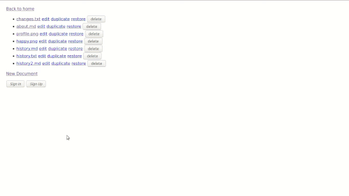
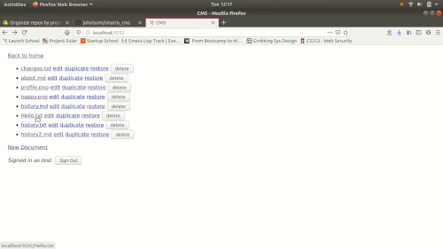
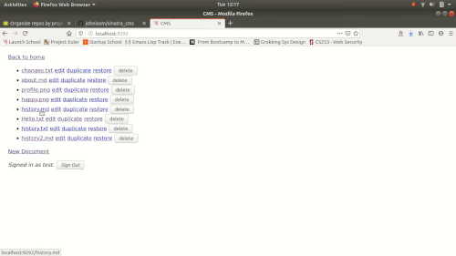
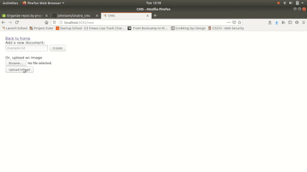

# Sinatra CMS #

This content management system was built with Sinatra on the back-end and uses
bcrypt to securely store hashed and salted passwords.

## Examples ##

Signing up, viewing text, markdown, and image files, and creating a file:

  

Editing a file multiple times and looking at the restore points:

  

Deleting files and unsuccessfully attempting to edit or restore an image file:

  

Uploading an image and then duplicating it:

  

## Features ##

- Multiple users
  - Sign in or create own user
  - Securely stores bcrypt salted and hashed passwords in YAML
  - Must be signed in to edit, delete, create, or restore files
- Create, view, edit, and delete files of any type
- HTML rendering of markdown files when viewing
- Photos are rendered normally
- Version control
  - Every time a change is made to a file, a restore point is created
  - The user can view the restore point before choosing to restore it 

## Constraints ##

- If you’re logged in as any user, you can edit and delete any file
- No virus or malware checking
- You can’t edit (including restore) an image file
